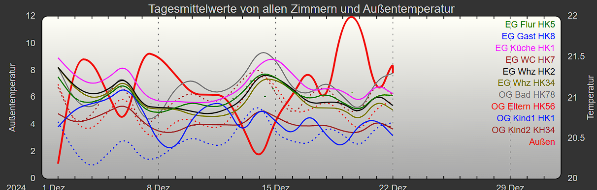

# Erzeugung von Mittelwerten in Logdateien für FHEM
=============================================

## Beschreibung
---------------

Um diese Grafik zu erzeugen, wurde dieses Programm entwickelt. Bis zu diesem Zeitpunkt wurden noch keine Statistikwerte durch FHEM automatisch (statistics-Modul) erzeugt und mussten aus den FileLog-Dateien nachträglich ergänzt werden. Nach diesem Zeitpunkt ist das Programm somit nicht mehr notwendig, da die Werte automatisch in die Logdatei eingetragen werden.

In der folgenden Grafik sieht man leider, dass die Heizkurve einfach nicht stimmt, da immer bei sinkenden Außentemperaturen die Zimmertemperaturen ansteigen. Ideal wäre, wenn die Zimmertemperaturen immer gleich blieben, auf ihrem Sollwert. Eine ähnliche Grafik existiert aktuell sinnvollerweise noch, die die Abweichungen der Solltemperaturen der Zimmer im Vergleich zu Außentemperaturen anzeigen. Ist aber nicht Bestandteil dieses Projektes.



Das Programm arbeitet pro Logdatei, die man direkt in der Kommandozeile als Parameter angeben muss. Das Programm kopiert diese im selben Verzeichnis mit der Dateiendung `.oldlog` und liest diese dann ein. Eine neue Datei wird erzeugt, die wie die ursprüngliche Eingabedatei heißt und zusätzlich zu den vorhandenen Textzeilen die Jahres-, Monats- und Tagesmittelwerte der Temperatur einfügt.

**Syntax:**
```
GenerateAvgLogTemperature [InputLogDatei.log]
```

Die Eingabedatei hat das folgende Format und es werden nur die Zeilen mit "temperature:" ausgewertet:

```
2020-05-10_23:20:02 eg.aussen.wettersensor temperature: 19.7
2020-05-10_23:20:03 eg.aussen.wettersensor humidity: 60.3
2020-05-10_23:20:03 eg.aussen.wettersensor absFeuchte: 10.2
2020-05-10_23:20:03 eg.aussen.wettersensor dewpoint: 11.8
2020-05-10_23:20:03 eg.aussen.wettersensor pressure: 978.5
2020-05-10_23:25:03 eg.aussen.wettersensor temperature: 19.7
2020-05-10_23:25:03 eg.aussen.wettersensor humidity: 61.1
2020-05-10_23:25:03 eg.aussen.wettersensor absFeuchte: 10.4

